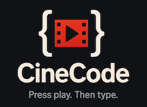
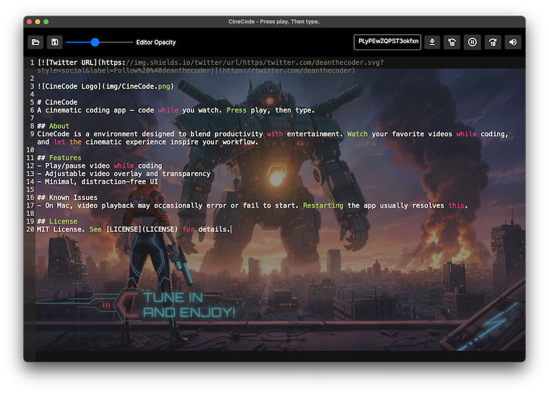

  

# CineCode
A cinematic coding app — code while you watch. Press play, then type.

  

## About
CineCode is a environment designed to blend productivity with entertainment. Watch your favorite videos while coding, and let the cinematic experience inspire your workflow.

## Features
- Play/pause video while coding
- Command palette with instant suggestions, including `?` for full command help
- Paste any YouTube video or playlist ID to start playback immediately
- Adjustable video overlay and transparency
- Minimal, distraction-free UI

## Command Palette Commands
- `?` — display every available command in the suggestion list
- `open` — pick a file to load into the editor
- `open recent` — reopen the most recent file without browsing
- `save` — write the current editor contents to disk
- `exit` — close CineCode
- Paste a YouTube video ID or playlist ID to start playing immediately

## Known Issues
- On Mac, video playback may occasionally error or fail to start. Restarting the app usually resolves this.

## License
MIT License. See [LICENSE](LICENSE) for details.
